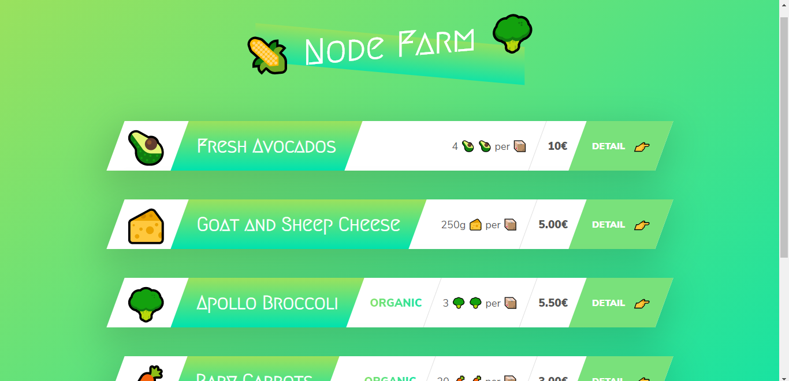
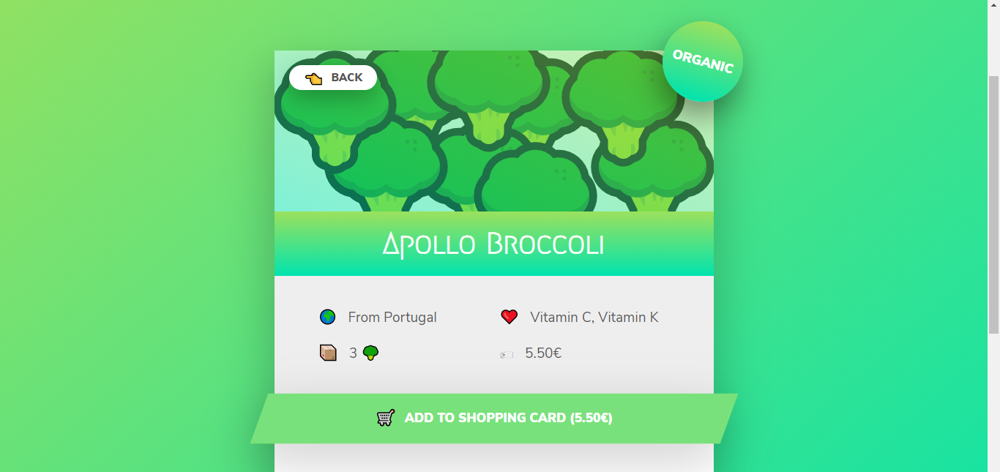

# Nodefarm
## Discription :small_red_triangle_down: :-
* Userfriendly interface to create easily access user without any issue.
* Scraped data store in a Database( JSON format) and JavaScript added new template in UI .
* Deploy on Heroku using GitHub.

 ## Technologies :rocket::-
Project is created with:
* Node.js :heavy_check_mark:
* JavaScript :heavy_check_mark:
* Jquery :heavy_check_mark:
* DOM :heavy_check_mark:
* HTML/CSS :heavy_check_mark:

## UI Image of the project :-

  
## Deploy Uing Heroku :-
[Click Link](https://nodeapp0712.herokuapp.com/)

  
